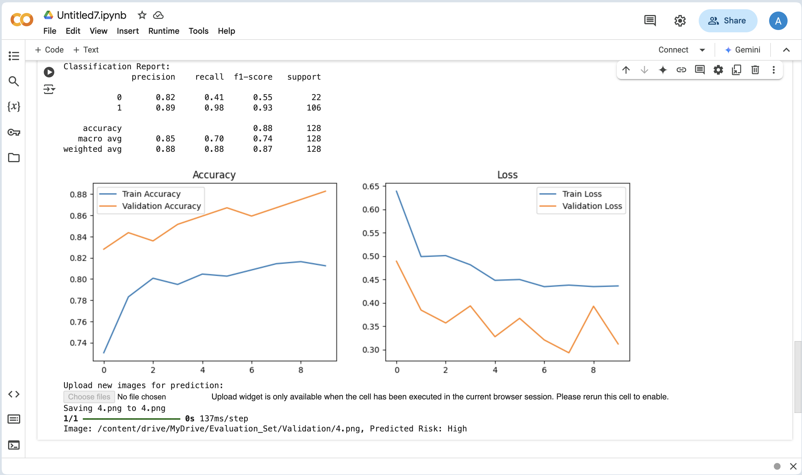

# CVD Prediction Using Retinal Images Through Deep Learning

## Overview

This project aims to predict cardiovascular disease (CVD) risk using retinal images through a deep learning model. The model is built using a Convolutional Neural Network (CNN) trained on retinal images labeled with disease risk.

## Features

- Uses retinal fundus images for CVD risk prediction.
- Implements a deep learning model using TensorFlow and Keras.
- Includes model training, evaluation, and real-time prediction capabilities.
- Provides data visualization with accuracy and loss plots.

## Dataset

The dataset consists of retinal fundus images and a corresponding CSV file containing image IDs and risk labels.

## Installation

1. Clone the repository:
   ```sh
   git clone https://github.com/yourusername/CVD-PREDICTION-USING-RETINAL-IMAGE.git
   cd CVD-PREDICTION-USING-RETINAL-IMAGE
   ```
2. Install dependencies:
   ```sh
   pip install -r requirements.txt
   ```

## Usage

### Train the Model

Run the training script:

```sh
python train.py
```

Alternatively, open and run `notebook.ipynb` in Google Colab.

### Predict on New Images

Upload new retinal images and run:

```sh
python predict.py --image path/to/image.png
```

## Model Architecture

The model consists of:

- Convolutional layers (Conv2D) for feature extraction.
- MaxPooling layers for downsampling.
- Fully connected Dense layers for classification.
- Sigmoid activation for binary classification.

## Results

The model achieves an accuracy of approximately **88%** on validation data. Below are the accuracy and loss plots during training:




## Folder Structure

```
CVD-PREDICTION-USING-RETINAL-IMAGE/
│── data/                   # Dataset folder
│── models/                 # Saved models
│── notebook.ipynb          # Jupyter Notebook (Colab compatible)
│── train.py                # Training script
│── predict.py              # Prediction script
│── requirements.txt        # Dependencies
│── README.md               # Project documentation
```

## Dependencies

Install dependencies from `requirements.txt`:

```
tensorflow
pandas
numpy
matplotlib
scikit-learn
google-colab
```

## Contributing

Feel free to contribute by submitting issues or pull requests.

## License

This project is licensed under the MIT License.

## Git Code

### Steps to Upload to GitHub

1. **Initialize Git and Add Files**

   ```sh
   git init
   git add .
   git commit -m "Initial commit - CVD Prediction Project"
   ```

2. **Create a New Repository on GitHub**\
   Go to [GitHub](https://github.com/new) and create a repository named `CVD-PREDICTION-USING-RETINAL-IMAGE`.

3. **Connect Local Repo to GitHub**

   ```sh
   git remote add origin https://github.com/yourusername/CVD-PREDICTION-USING-RETINAL-IMAGE.git
   git branch -M main
   git push -u origin main
   ```

4. **Verify the Push** Go to `https://github.com/yourusername/CVD-PREDICTION-USING-RETINAL-IMAGE` to see your files.

